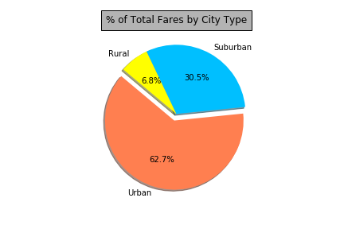
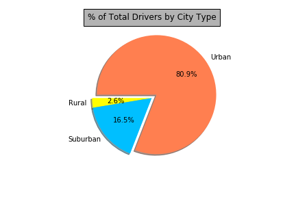

# PyBer
In this project, our objective is to build a chart that showcases the relationship between various factors company that contains different elements of information.

# Project Summary
Your objective is to build a [Bubble Plot](https://en.wikipedia.org/wiki/Bubble_chart) that showcases the relationship between four key variables:
* Average Fare ($) Per City
* Total Number of Rides Per City
* Total Number of Drivers Per City
* City Type (Urban, Suburban, Rural)

In addition, you will be expected to produce the following three pie charts:
* % of Total Fares by City Type

* % of Total Rides by City Type

![2-Pie](Pyber/Pie1.png]

* % of Total Drivers by City Type

